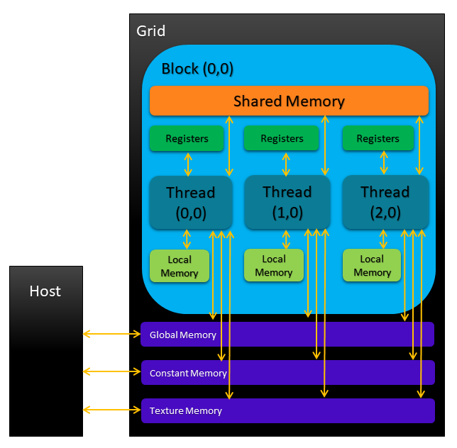

> ## Table of Contents
> - [1. Overview](#1-overview)
> - [2. CUDA Memory Model](#2-cuda-memory-model)
>  - [2.1. Principle of Locality](#21-principle-of-locality)
>  - [2.2. Memory Hierarchy](#22-memory-hierarchy)
>    - [2.2.1. Registers](#221-registers)
>    - [2.2.2. Local Memory](#222-local-memory)
>    - [2.2.3. Shared Memory](#223-shared-memory)
>    - [2.2.4. Constant Memory](#224-constant-memory)
>    - [2.2.5. Texture Memory](#225-texture-memory)
>    - [2.2.6. Global Memory](#226-global-memory)
>    - [2.2.7. GPU Cache Space](#227-gpu-cache-space)
>  - [2.3. Host-Device Memory Management](#23-host-device-memory-management)
>    - [2.3.1. Pinned Memory](#231-pinned-memory)
>    - [2.3.2. Zero-copy Memory](#232-zero-copy-memory)
>    - [2.3.3. Unified Virtual Addressing](#233-unified-virtual-addressing)
>    - [2.3.4. Unified Memory](#234-unified-memory) 
{: .prereq}

In [MolSSI's Fundamentals of Heterogeneous Parallel Programming with CUDA
 C/C++ at the beginner level](http://education.molssi.org/gpu_programming_beginner),
we have provided a comprehensive presentation of the CUDA programming, compilation 
and execution models. These models layout the fundamental aspects of CUDA programming
platform and expose various conceptual parallelism abstractions at the logical 
architectural and application levels.

This lesson extends the scope of NVIDIA's heterogeneous parallelization platform to
**CUDA memory model**, which exposes a unified hierarchical memory abstraction for both 
host and device memory systems. Here, we discuss CUDA memory model, one of the most important
topics in heterogeneous parallel programming with CUDA C/C++. CUDA exposes various type of 
programmable device memory types in a hierarchical structure which allows user to leverage 
additional levels of parallelism, an advantage that is not usually available with 
non-programmable memory in CPU parallelization. Using multiple examples, we demonstrate how
a deeper knowledge of GPU architecture and memory types allows the programmer to design more 
efficient parallel program using CUDA memory model.

## 2. CUDA Memory Model

Before getting our hands dirty with the technicalities of coding, let us delve into the important 
aspects of the of CUDA memory model in some details.

### 2.1. Principle of Locality

 The CUDA memory model is based on the **locality principle** which reduces the memory access 
 latency through an efficient way of reusing data. There are two types of locality:

- **Spatial locality** (locality in space)
- **Temporal locality** (locality in time)

Spatial locality assumes that once a memory address is referenced, its neighboring memory locations
become more likely to be referenced as well. As example is when the processor attempts to access a
contiguous array of data stored on the global memory. Temporal locality assumes that once a memory
location is accessed, there is a higher probability for it to be referenced again in a short period
of time and lower probabilities at later times.

In [Fundamentals of Heterogeneous Parallel Programming with CUDA C/C++](http://education.molssi.org/
gpu_programming_beginner/01-introduction/#2-parallel-programming-paradigms), we described the main 
features of a typical modern GPU architecture which comparing them with those of GPU. There, 
we explained that one of the most important hardware features of the CPU is its relatively 
large cache memory size which allows it to improve the application optimization process by 
benefiting from temporal and spatial locality.

Allows users to fully take control of the data flow within programmable memory levels such as registers,
 shared memory *etc.* . Here, 

### 2.2. Memory Hierarchy

In order to improve the performance of the memory operations, CUDA memory model adopts 
the **memory hierarchy** consisting of various memory levels with different bandwidths, latencies, 
and capacities. Within this hierarchy, as the capacity of the memory type increases, the latency also
increases. 

As we discussed in [Fundamentals of Heterogeneous Parallel Programming with CUDA C/C++](http://education.molssi.org/
gpu_programming_beginner/01-introduction/#2-parallel-programming-paradigms), 
both CPU and GPU main memory spaces are constructed by dynamic random access memory (DRAM). The lower-latency 
memory units such as cache, however, are built using static random access memory (SRAM). As such, 
based on the memory hierarchy, it would be logical to keep the data that are actively used by the processor
in the low-latency and low-capacity memory spaces and store the less frequently used ones in high-latency high-capacity
memory spaces for possible future usage. 

Although both CPU and GPU adopt similar hierarchical memory design models, CUDA programming model exposes much more 
control over and access to memory levels in the hierarchy than what is possible with CPUs. There are two main memory 
categories:

- **Non-programmable** where programmer has no control over data flow in the memory unit, and
- **Programmable** where the user is in charge of data load/storage within the memory unit.

The CPU L1 and L2 cache are examples of non-programmable memories. Nevertheless, CUDA memory 
model exposes several types of programmable memory spaces on the device, each with its own 
*lifetime*, *scope* and *caching rules*:

- **Registers**
- **Shared memory**
- **Local memory**
- **Constant memory**
- **Texture memory**
- **Global memory**

The following figure provides a simplified representation of the memory hierarchy.

As the figure illustrates, each thread within a kernel has its own private local memory.  
Shared memory belongs to all threads in a block. The contents in the shared memory are accessible
to all threads within a block and have the same lifetime as that of the thread block. The contents of
constant, texture and global memories have the same lifetime as that of the application and are 
accessible to all threads on the device; however, their applications are quite different, which we 
will explain, shortly.

#### 2.2.1. Registers

Registers are precious resources partitioned among active warps on the GPU with the lowest capacity 
and highest data transfer speed. Variables stored on registers such as automatic kernel variables 
declared without qualifiers or arrays declared in kernels with constant referencing indices determined 
at the compilation time, are private to each thread. According to the principle of locality, the data 
being held in registers are often frequently accessed by kernels while their lifetime ends with the 
completion of kernel execution.

Using fewer registers within kernels can lead to higher performance resulting from the increased 
[**occupancy**](https://docs.nvidia.com/cuda/cuda-runtime-api/group__CUDART__OCCUPANCY.html#group__CUDART__OCCUPANCY)
of the thread locks per streaming multiprocessor (SM).

> ## Note:
> Occupancy is a helpful performance metric which is based on the ideal intention of 
> keeping as many device cores occupied as possible. Occupancy is defined as the ration
> of active warps to the maximum number of warps per SM. Although it is a useful metric for
> analysis and description of the observed benchmark profiling logs, it should not be a hard
> and only reference for code optimization. There can be many cases that increased occupancy
> does not always mean improved performance. We will discuss profiling performance metrics in
> [here]().
{: .discussion}

On the other hand, if a kernel attempts to utilize more registers than the limit imposed by the 
hardware resources, the excess memory would spill over local memory. The **register spill** and 
[**register pressure**](https://docs.nvidia.com/cuda/cuda-c-best-practices-guide/index.html#register-pressure)
should be avoided if possible due to its serious performance consequences. Here, we provide two ways
to control the number of registers: 1) `-maxrregcount` compiler option, and 2) 
[`__launch_bounds__()` qualifier method](https://docs.nvidia.com/cuda/cuda-c-programming-guide/index.html#launch-bounds).
The former approach can be used by simply passing the [`-maxrregcount=N` option](https://docs.nvidia.com/cuda/cuda-compiler-driver-nvcc/index.html#options-for-steering-gpu-code-generation-maxrregcount) to the nvcc 
compiler where `N` denotes the maximum number of registers *used by all kernels*. The latter method uses the 
`__launch_bounds__()` qualifier method after the kernel declaration specification qualifier in order to provide
the necessary information to the compiler through its arguments, `maxThreadsPerBlock` and `minBlocksPerMultiProcessor` as

~~~
__global__ void __launch_bounds__(maxThreadsPerBlock, minBlocksPerMultiprocessor)
kernel(...) {
  // kernel body implementation
}
~~~
{: .language-cuda}

Here, `maxThreadsPerBlock` specifies the maximum number of threads per block with which the `kernel()` is launched.
The `minBlocksPerMultiprocessor` is an optional argument which denotes the desired minimum number of resident thread 
blocks per SM.

The provided information through `__launch_bounds__()` method take precedence over that provided 
by the compiler option `-maxrregcount` and in cases where both methods are adopted, the latter is ignored.

#### 2.2.2. Local Memory

Kernel variables that cannot fit into registers create a *register pressure* and *spill* into local memory.
Variables types that are eligible to be stored in local memory are: 1) local arrays with reference indices that
cannot be inferred at compilation time, and 2) any variable (such as local arrays or structures) that are too large
to fit in register.

Note that those data that are spilled into the *local* memory reside in the same physical location as *global* memory. 
Therefore, significant performance degradation is expected as the data access/transfer will now be subjected to the 
low bandwidth and high latency limitations of the global memory.

> ## Note:
> The resident data in local memory are cached in each SM's L1 and each device's L2 cache memory spaces for GPUs 
> with compute capability 2.0 and higher.
{: .discussion}

#### 2.2.3. Shared Memory

Similar to registers, shared memory is a valuable on-chip programmable memory resource with significantly lower latency 
and higher bandwidth than those of local/global memory. The `__shared__` qualifier can be used for explicit shared memory 
variable declaration. Shared memory can be allocated statically or dynamically and variables can be declared within the 
global or kernel's local scope. Let us statically allocate the shared memory for a 2-dimensional array of integers

~~~
__shared__ int array[dimX][dimY];
~~~
{: .language-cuda}

where `dimX` and `dimY` are predefined integer variables. If the size of the required shared memory (in this case, 
`dimX * dimY * sizeof(int)`) is not known at the compilation time, the memory block for the array of variable size 
can be allocated dynamically using the `extern` keyword

~~~
extern __shared__ int array[];
~~~
{: .language-cuda}

The postponed specification of the desired allocated memory size for the array should now be defined at the run-time
for each thread as the third argument in the execution configuration (triple angular brackets)

~~~
kernel<<< numberOfBlocksInGrid, numberOfThreadsinBlock, dimX * dimY * sizeof(int) >>>(array, ...)
~~~
{: .language-cuda}

where the desired size should be expressed in bytes, hence the use of [`sizeof()`](https://en.cppreference.com/w/cpp/language/sizeof).
> ## Note:
> Only 1-dimensional arrays can be declared dynamically in shared memory.
{: .discussion}

Since shared memory is distributed among thread blocks and is key for intra-block/inter-thread cooperation, a naive usage 
of shared memory can limit the number of active warps and affect the performance. Furthermore, the lifetime and scope of 
shared memory is limited by those of kernels and when the thread block finishes its execution, the allocated shared memory
for that block is released and becomes available to other thread blocks.

In order to create an explicit barrier for synchronization of all threads in the same thread block, CUDA runtime introduces the
following functionality

~~~
void __syncthreads();
~~~
{: .language-cuda}

which is especially useful for preventing data race [hazards](https://docs.nvidia.com/cuda/cuda-memcheck/index.html#what-are-hazards)
in parallel applications. Data hazards often happen when multiple threads attempt to access a memory address in an arbitrary order 
where at least one thread performs a store (or write) operation. Care must be taken with the usage 
of [`__syncthreads()`](https://docs.nvidia.com/cuda/cuda-c-programming-guide/index.html#cooperative-groups) since it can negatively
affect the performance by stalling the SM, frequently.

The on-chip memory space and hardware resources used for both L1 cache and shared memory is statically partitioned by default. 
However, this configuration can be dynamically modified at using the CUDA runtime function [`cudaFuncSetCacheConfig()`](https://docs.nvidia.com/
cuda/cuda-runtime-api/group__CUDART__EXECUTION.html#group__CUDART__EXECUTION_1g6699ca1943ac2655effa0d571b2f4f15)

~~~
cudaError_t cudaFuncSetCacheConfig(const void* func, enum cudaFuncCache cacheConfig);
~~~
{: .language-cuda}

The first argument, `func`, denotes the device function symbol and [`cudaFuncCache`](https://docs.nvidia.com/cuda/
cuda-runtime-api/group__CUDART__TYPES.html) is an `enum` type variable that stands for the CUDA cache configurations 
and can take the following values

| Cache Configuration       | Value |                     Meaning                      |
| :------------------------ | :---: | :----------------------------------------------: |
| cudaFuncCachePreferNone   |   0   |      No preference (default configuration)       |
| cudaFuncCachePreferShared |   1   | Prefer larger shared memory and smaller L1 cache |
| cudaFuncCachePreferL1     |   2   | Prefer larger L1 cache and smaller shared memory |
| cudaFuncCachePreferEqual  |   3   |   Prefer equal size L1 cache and shared memory   |

> ## Note:
> The `cudaFuncSetCacheConfig()` function does nothing on devices with fixed L1 cache and shared memory sizes.
{: .discussion}

#### 2.2.4. Constant Memory

Variables can be declared in constant memory space through using the `__constant__` qualifier.
The constant memory variables must be declared in global scope. Furthermore, the amount of constant memory that
can be declared is limited: 64 kB for all compute capabilities. Moreover, the constant memory is statically allocated
and its content is visible to all threads and kernels in the read-only mode. The best performance from using constant 
memory is expected when all threads within a warp read from the same memory address: here the contents of the constant 
memory location is broadcasted to all threads in a warp through a single load operation. For example, a numerical constant
can be stored in constant memory and read by threads in warp(s) to scale the components of an array.

The [`cudaMemcpyToSymbol()`](https://docs.nvidia.com/cuda/cuda-runtime-api/group__CUDART__MEMORY.html
#group__CUDART__MEMORY_1g9bcf02b53644eee2bef9983d807084c7) function can be used to initialize the constant memory from
the host

~~~
cudaError_t cudaMemcpyToSymbol(const void* symbol, const void* src, size_t count);
~~~
{: .language-cuda}

Here, `count` bytes from the memory address pointed to by the pointer variable `src` is copied to the memory location
pointed to by `symbol` residing in the constant or global memory space. The `cudaMemcpyToSymbol()` is 
[synchronous](https://docs.nvidia.com/cuda/cuda-runtime-api/api-sync-behavior.html#api-sync-behavior__memcpy-sync) with
respect to the host in most cases. Constant memory is cached using a dedicated per-SM constant cache space and is best
used in uniform read operations where each thread in a warp accesses the same memory address.

#### 2.2.5. Texture Memory

Similar to the constant memory, the texture memory is also cached per-SM through read-only cache which supports hardware
filtering such as performing floating-point interpolation as part of the data load process. Contrary to the constant cache
where the accessed data is usually small and read uniformly by the threads in a warp, the read-only cache is more suitable
for the scattered data access on larger data sets. The texture memory is designed to benefit for the 2-dimensional spatial
locality. Therefore, the best performance can be expected from texture memory when the accessed data is 2-dimensional.
Note that depending on the application, the expected performance from texture memory might be lower than that of the global
memory.

#### 2.2.6. Global Memory

Global memory is the most commonly used memory type on GPUs which has the highest latency and size capacity. The contents of 
global memory have global scope and can be accessed by all threads and kernels on the device and their lifetime is the same 
as that of the running application. Variables in global memory can be declared statically or dynamically. In the 
[Basics of the Device Memory Management in CUDA](http://education.molssi.org/gpu_programming_beginner/03-cuda-program-model/
#1-basics-of-the-device-memory-management-in-cuda), we demonstrated how to adopt [`cudaMalloc()`](https://docs.nvidia.com/
cuda/cuda-runtime-api/group__CUDART__MEMORY.html#group__CUDART__MEMORY_1g37d37965bfb4803b6d4e59ff26856356), 
[`cudaFree()`](https://docs.nvidia.com/cuda/cuda-runtime-api/group__CUDART__MEMORY.html#group__CUDART__MEMORY_1ga042655cbbf3408f01061652a075e094), 
[`cudaMemset()`](https://docs.nvidia.com/cuda/cuda-runtime-api/group__CUDART__MEMORY.html#group__CUDART__MEMORY_1gf7338650f7683c51ee26aadc6973c63a)
and [`cudaMemcpy()`](https://docs.nvidia.com/cuda/cuda-runtime-api/group__CUDART__MEMORY.html#group__CUDART__MEMORY_1gc263dbe6574220cc776b45438fc351e8)
CUDA runtime APIs to dynamically allocate, deallocate, initialize and copy global memory, respectively. The static declaration
of a variable in global memory can be performed using the `__device__` qualifier. Note that global memory has the highest 
latency in data access among all memory types within CUDA memory model's hierarchy.

It is important to note that since threads' execution cannot be synchronized between different thread blocks, the possibility of data
hazard caused by simultaneous modifications of the same global memory address by multiple threads from different blocks should be avoided.

#### 2.2.7. GPU Cache Space

In addition to the programmable memory spaces within CUDA memory model's hierarchy, GPU devices are often armed with four types of 
non-programmable cache memories

- **L1**
- **L2**
- **Constant (Read-only)**
- **Texture (Read-only)**

On a CPU, both read and write operations can be cached. However, only the load operation can be cached on a GPU device.
Each SM has its own L1 cache while there is only one L2 cache memory space shared by all SMs on the device. In addition to L1 
and L2 cache memory spaces, constant and texture read-only cache spaces are provided in order to improve specific applications 
performed on the GPU devices.

### 2.3. Host-Device Memory Management

Since in heterogeneous parallel programs within CUDA framework, the host (CPU and its memory) and the device (GPU and its memory) 
domains are distinct, memory management becomes an important task for the programmer. For example, although both host and kernel
variables can be defined in the same code file, the host functions or device kernels cannot generally access the variables from the 
other domain. CUDA runtime API functions are often implemented in a way that they make pre-assumptions about the memory space of the
incoming arguments and variables. Therefore, it becomes programmer's responsibility to pass variables from appropriate memory domains
to the runtime API functions or otherwise program ends with a crash or an undefined behavior.

Before getting into the concept of pinned memory and and why they exist, let us focus on a few key concepts pertinent to the computer 
memory management system that we will be frequently dealing with in our tutorial. The first concept in our list is 
[**page fault**](https://en.wikipedia.org/wiki/Page_fault), exceptions raised by computer hardwares when a running application attempts 
to access a [**memory page**](https://en.wikipedia.org/wiki/Page_(computer_memory)) (*i.e.*, a fixed-length contiguous block of 
[**virtual memory**](https://en.wikipedia.org/wiki/Virtual_memory)) that had not been mapped into the 
[**virtual address space (VAS)**](https://en.wikipedia.org/wiki/Virtual_address_space) by the [**memory management unit (MMU)**](https://
en.wikipedia.org/wiki/Memory_management_unit). MMU's main responsibility is to translate all virtual memory addresses to their 
physical counterparts. Contrary to what their name might convey, valid page *faults* are in fact necessary tools for any operating system 
(OS), armed with virtual memory, in order to make the required page accessible, increase the amount of available memory to each program or
terminate it when an illegal memory access occurs.

#### 2.3.1. Pinned Memory

By default, the allocated memory on the host domain is pageable: it is prone to page faults. Since the OS might move the data between different
physical memory locations on the host at any moment, the GPU device cannot securely access the memory addresses corresponding to specific data.
Therefore, in order to transfer data from a pageable host memory location to a memory address on the device, CUDA driver temporarily
allocates [**page-locked** or **pinned** memory](https://docs.nvidia.com/cuda/cuda-c-best-practices-guide/index.html#pinned-memory) on the host
and copies the data to the pinned memory locations. Then, those data can be safely transferred to the device memory destination.

The host pinned memory can be allocated using the CUDA runtime function, [`cudaMallocHost()`](https://docs.nvidia.com/cuda/cuda-runtime-api/
group__CUDART__HIGHLEVEL.html#group__CUDART__HIGHLEVEL_1gd5c991beb38e2b8419f50285707ae87e) as

~~~
cudaError_t cudaMallocHost(void** ptr, size_t count);
~~~
{: .language-cuda}

where `count` bytes of the host memory, pointed to by `ptr`, become page-locked and directly accessible to the device. As such, pinned memory
that is now accessible to the device benefits from higher bandwidths than pageable memory on the host for load/storage operations.

Page-locked memory can be released via using [`cudaFreeHost()`](https://docs.nvidia.com/cuda/cuda-runtime-api/
group__CUDART__MEMORY.html#group__CUDART__MEMORY_1g71c078689c17627566b2a91989184969) as

~~~
cudaError_t cudaFreeHost(void* ptr);
~~~
{: .language-cuda}

Higher bandwidths in pinned memory (compared to that of pageable host memory) makes it more suitable for high-throughput 
large-scale data transfer. However, pinning to much host memory takes away from what is otherwise available to the system
for storing data in virtual (host) memory causing significant performance penalties. Furthermore, allocation and deallocation
of pinned memory are more expensive operations than those for pageable host memory. Hence, the expected speedups resulting 
from adopting pinned memory also become dependent upon the compute compatibility of the device being employed as well.

In general, data transfers between host and the device should be minimized in the program. One effective technique to 
achieve this goal is to hide the data transfer latency by overlapping it with kernel execution through CUDA streams and concurrency.
We will discuss this topic in details later in this tutorial.

#### 2.3.2. Zero-copy Memory

[Zero-copy memory](https://docs.nvidia.com/cuda/cuda-c-programming-guide/index.html#zero-copy-memory) is a non-pageable 
(page-locked) memory that is mapped into the device memory address space. Therefore, it breaches the separation of the host 
and the device memory domains by being accessible both to host and GPU threads. Zero-copy memory can be allocated via
[`cudaHostAlloc()`](https://docs.nvidia.com/cuda/cuda-runtime-api/group__CUDART__MEMORY.html#group__CUDART__MEMORY_1gb65da58f444e7230d3322b6126bb4902)
CUDA runtime API

~~~
cudaError_t cudaHostAlloc(void** pHost, size_t size, unsigned int flags);
~~~
{: .language-cuda}

where the third argument, `flags`, can have the following values

- [**`cudaHostAllocDefault`**](https://docs.nvidia.com/cuda/cuda-runtime-api/group__CUDART__TYPES.html#group__CUDART__TYPES_1g1e00f7734325eb38d75f3ffeae6acac8) 
- [**`cudaHostAllocPortable`**](https://docs.nvidia.com/cuda/cuda-runtime-api/group__CUDART__TYPES.html#group__CUDART__TYPES_1gc46ce76be41cf79774331cc8cfceb52b)
- [**`cudaHostAllocMapped`**](https://docs.nvidia.com/cuda/cuda-runtime-api/group__CUDART__TYPES.html#group__CUDART__TYPES_1g01e600c738b962c8f973dda7708f7a70)
- [**`cudaHostAllocWriteCombined`**](https://docs.nvidia.com/cuda/cuda-runtime-api/group__CUDART__TYPES.html#group__CUDART__TYPES_1g3a7db37d02ce0b2350067ab639ef321c) 

The `cudaHostAllocDefault` option causes `cudaHostAlloc()` becomes equivalent to `cudaMallocHost()`. Adopting `cudaHostAllocPortable` option dictates
all CUDA contexts (not just the allocator) to consider the allocated memory as pinned memory. Using the `cudaHostAllocWriteCombined` option, the allocated 
memory becomes of write-combined (WC) type which can be transferred more efficiently across the PCI Express bus on some system configurations. The read 
operations on WC memory might not be as efficient with most CPUs. Therefore, WC memory becomes a good candidate for buffers written by the CPUs and read by
the device via mapped pinned memory or through host-to-device transfers. With `cudaHostAllocMapped` option, the allocated memory is mapped into the CUDA 
address space. A device pointer, `devPtr`, corresponding to the host allocated pinned memory buffer, pointed to by `hostPtr`, may be obtained through [`cudaHostGetDevicePointer()`](https://docs.nvidia.com/cuda/cuda-runtime-api/group__CUDART__MEMORY.html#group__CUDART__MEMORY_1gc00502b44e5f1bdc0b424487ebb08db0) CUDA runtime API as

~~~
cudaError_t cudaHostGetDevicePointer(void** devPtr, void* hostPtr, unsigned int flags);
~~~
{: .language-cuda}

where according to the CUDA Toolkit [documentation](https://docs.nvidia.com/cuda/cuda-runtime-api/
group__CUDART__MEMORY.html#group__CUDART__MEMORY_1gc00502b44e5f1bdc0b424487ebb08db0), the `flags` variable in here will be used in future releases and 
should be set to zero at the moment. It is important to note that all transactions to the page-locked mapped memory address has to pass through PCI-express bus
connection which because of its low bandwidth cau cause significant latency in data transfer involving frequent load/store operations. Therefore, it should be
used with caution as in many cases, using global memory might simply provide a better alternative for performance reasons.

The page-locked host memory can be released using [`cudaFreeHost()`](https://docs.nvidia.com/cuda/cuda-runtime-api/
group__CUDART__MEMORY.html#group__CUDART__MEMORY_1g71c078689c17627566b2a91989184969). 

> ## Note:
> Since the zero-copy memory is shared between the host and the device, access to data on the mapped page-locked memory address should be 
> synchronized across both domains or otherwise, undefined behavior due to data hazard can occur.
{: .discussion}

#### 2.3.3. Unified Virtual Addressing

Introduced in CUDA 4.0 and supported by devices with compute compatibility 2.0 and later, unified virtual addressing (UVA) provides a Unified Memory
address space for both host and device. For systems without UVA support, pointers to host and device memory locations must be explicitly distinguished
and specified by the programmer.

On the other hand, UVA unifies memory space addressing making the corresponding host and device pointers identical and accessible to the entire application.
It might be instructive to explain in more detail how using UVA might be more convenient than working with pinned memory. For example, with zero-copy memory,
one should 1) allocate mapped non-pageable host memory, 2) obtain device pointer to the mapped memory using `cudaHostGetDevicePointer()` CUDA runtime API,
and 3) pass the received pointer in the previous step to the intended kernel. Within UVA framework, the need for creating/managing two separate pointers
to host and device memory addresses or getting device pointers through `cudaHostGetDevicePointer()` CUDA runtime function is lifted. Therefore, the pointers
set by `cudaHostAlloc()` functions can be directly passed to the kernel.

#### 2.3.4. Unified Memory

NVIDIA introduced Unified Memory in CUDA 6.0 as a new feature to improve maintainability and readability in CUDA programs and to simplify memory management 
in the application. In this framework, memory allocations from Unified Memory pool are automatically managed by the system and become accessible to both host
and device via a single memory address pointer. Based on memory access request from the host or the device, the Unified Memory system automatically migrates
data in the Unified Memory space. As such, the need for explicit management of the memory allocation and data transfer, as discussed in 
[Basics of the Device Memory Management in CUDA](http://education.molssi.org/gpu_programming_beginner/03-cuda-program-model/#1-basics-of-the-device-memory-management-in-cuda), is lifted. 

Managed memory can be allocated statically or dynamically. For static declaration of a memory-managed GPU variable, simply add the qualifier `__managed__`
to its declaration as follows 

~~~
__device__ __managed__ double x;
~~~
{: .language-cuda}

Note that this method should only be used within file- and global scopes. Managed memory can also be dynamically allocated using the CUDA runtime function,
[``](https://docs.nvidia.com/cuda/cuda-runtime-api/group__CUDART__MEMORY.html#group__CUDART__MEMORY_1gd228014f19cc0975ebe3e0dd2af6dd1b) as

~~~
cudaError_t cudaMallocManaged (void** devPtr, size_t size, unsigned int flags = cudaMemAttachGlobal);
~~~
{: .language-cuda}

where `devPtr` is the pointer to the allocated device memory, `size` is the size of the allocated memory bytes and `flags` specifies the default stream 
association for the intended managed memory allocation and must be set either to [`cudaMemAttachGlobal`](https://docs.nvidia.com/cuda/cuda-runtime-api/
group__CUDART__TYPES.html#group__CUDART__TYPES_1g4808e47eba73eb94622ec70a9f9b91ff) (default) or [`cudaMemAttachHost`](https://docs.nvidia.com/cuda/
cuda-runtime-api/group__CUDART__TYPES.html#group__CUDART__TYPES_1g4f9a428d18fdd89a99441d0dd27131c0). The `cudaMemAttachGlobal` flag makes the allocated
managed memory accessible from any stream or device. On the contrary, the `cudaMemAttachHost` flag restricts the access to the allocated memory only to
those devices that have a non-zero value for the device attribute [`cudaDevAttrConcurrentManagedAccess`](https://docs.nvidia.com/cuda/cuda-runtime-api/
group__CUDART__TYPES.html#group__CUDART__TYPES_1gg49e2f8c2c0bd6fe264f2fc970912e5cdc88178f29891f2c18fe67361cc80de09). Managed memory should be deallocated
using [`cudaFree()`](https://docs.nvidia.com/cuda/cuda-runtime-api/group__CUDART__MEMORY.html#group__CUDART__MEMORY_1ga042655cbbf3408f01061652a075e094)
CUDA runtime API.

> ## Note:
> Since it is not possible to call `cudaMallocManaged()` in CUDA 6.0, every managed memory must either be dynamically allocated from the host or 
> statically declared within global scope.
{: .discussion}

We should point out that although Unified Memory requires UVA's support, they should be distinguished as completely different technological frameworks.
UVA offers a Unified Memory address space for every processor installed within the system. However, contrary to the Unified (managed) Memory, UVA does not
automatically migrate data from one memory location to another and across host-device domains. 

Unified Memory is also similar to the zero-copy memory in as they both provide shared access to data for the host and the device. However, the host-based 
allocation of the zero-copy memory causes the memory access performance to suffer from having to manually transfer data over PCIe bus with high-latency. 
Unified memory system, on the other hand, does not suffer from the aforementioned issues as it can automatically migrate data, on demand, between host 
and device in order to enhance the locality and ultimately, performance.

